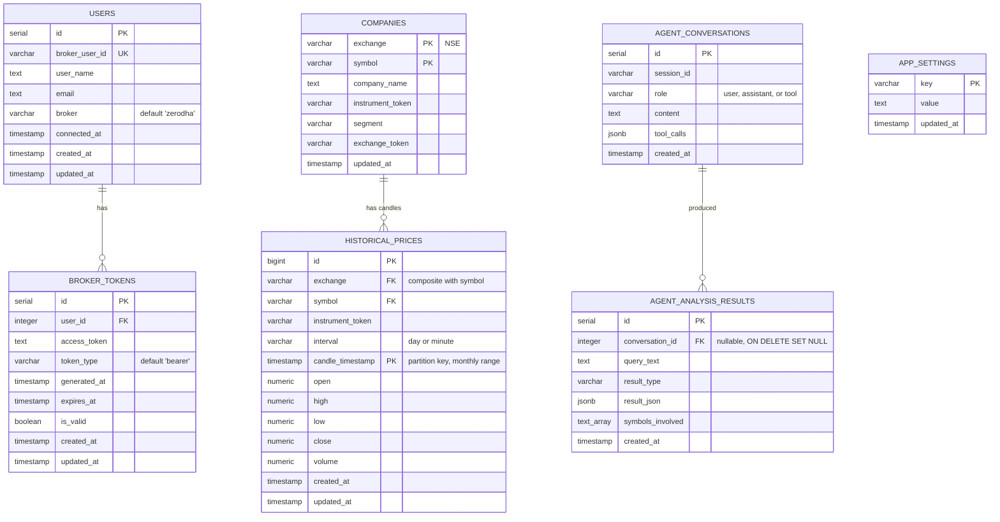

# Entity-Relationship Diagram

Reflects the schema as of migration `008_add_exchange_identity.sql`. Renders automatically on GitHub and in VSCode (with a Mermaid preview extension).

## Notes

- **`COMPANIES`**: primary key is the composite `(exchange, symbol)` — trading symbols aren't globally unique (e.g. `RELIANCE` trades on both NSE and BSE under the same tradingsymbol with different `instrument_token`s), so identity requires both columns together (added in migration `008`).
- **`HISTORICAL_PRICES`**: partitioned by month on `candle_timestamp` (see `007_partition_historical_prices.sql`) — ~49 partitions covering roughly 3 years back to 1 year forward, plus a `DEFAULT` catch-all partition. The FK to `COMPANIES` is also composite: `(exchange, symbol)`. Unique constraint is `(exchange, symbol, interval, candle_timestamp)` — one row per candle per symbol per exchange per interval (day/minute).
- **`AGENT_ANALYSIS_RESULTS.conversation_id`** is nullable with `ON DELETE SET NULL` rather than `CASCADE` — deleting a conversation doesn't destroy the analysis history it produced.
- **`APP_SETTINGS`** is a legacy key/value table (predates `USERS`/`BROKER_TOKENS`) — migration `001` migrates any existing Kite access token out of it, but the table itself isn't dropped.
- **`schema_migrations`** (tracking table created by `backend/scripts/migrate.js`, not shown above) just records which migration files have run — not part of the application's data model.
